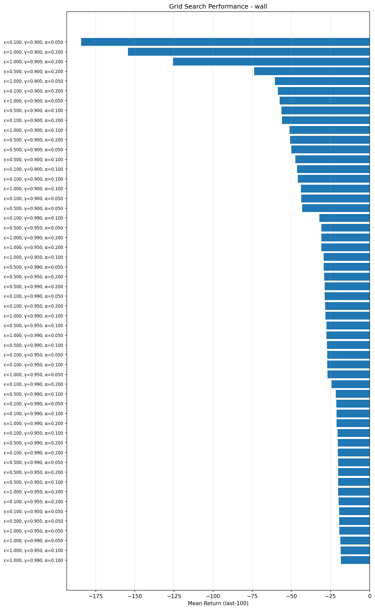
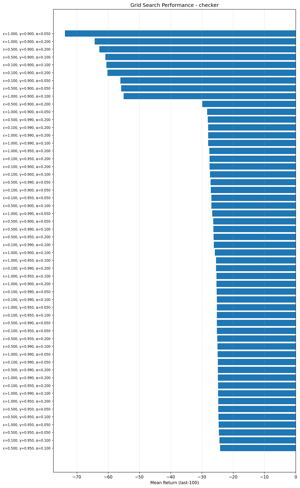
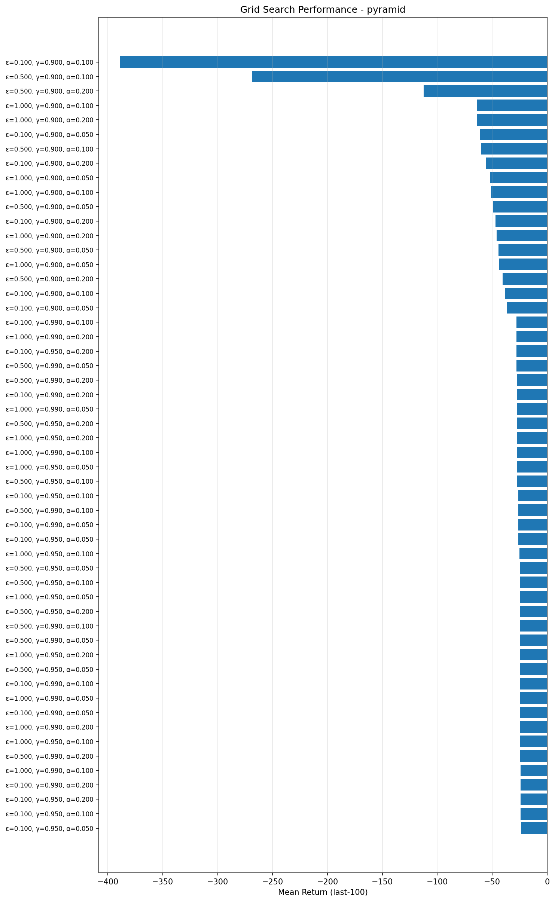
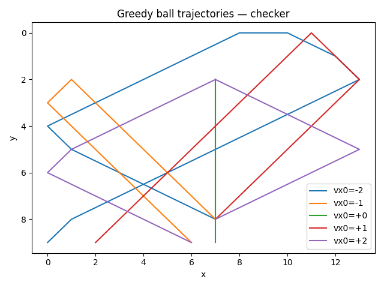
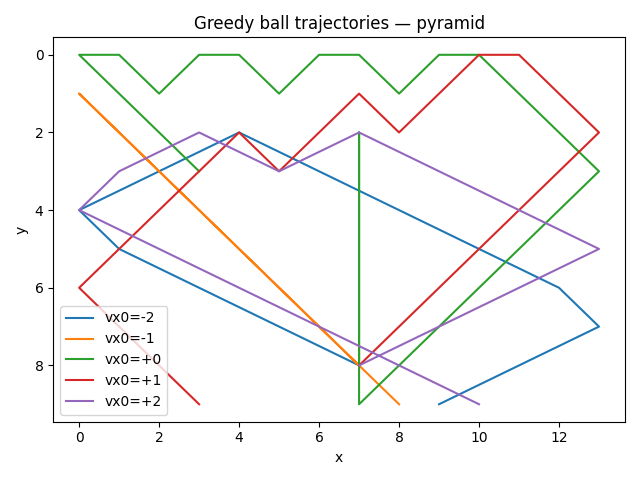
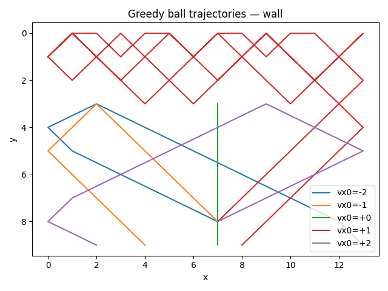

# Monte‑Carlo Control Agent for a Breakout Clone

<a href="https://www.python.org"></a>

---

## 🎮 Project Summary

This project implements **on‑policy Monte‑Carlo Control** to learn an optimal policy for a grid‑based Breakout clone developed for the *Reinforcement Learning* exercise at TU Wien. A minimal custom environment (`game_env.py`) models the ball, paddle and brick collisions; an `MC_agent` learns from episodic returns using ε‑greedy exploration and incremental Q‑value updates.  The training script performs a small hyper‑parameter grid‑search and stores plots that illustrate convergence behaviour and the learned ball trajectories.

**Learning Focus**  
The focus of this exercise was to build the game environment from scratch, code the Monte‑Carlo agent, and design the training pipeline using pure Python and NumPy - rather than relying on external RL frameworks or aiming for production‑grade performance.


---

## 📂 Repo Structure

```text
├── game_env.py          # Minimal, custom Breakout environment (no external deps)
├── MC_agent.py          # On‑policy Monte‑Carlo agent
├── train_script.py      # Training loop, grid‑search & plotting
├── plots/               # ↖ autogenerated; store all PNG results here
│   ├── trajectories_*.png
│   ├── grid_*_.png
│   └── ...
└── README.md            # <–– you are here
```
---

## 🏗 Environment Details

| Parameter     | Value                                                | Notes                                          |
| ------------- | ---------------------------------------------------- | ---------------------------------------------- |
| Grid size     | 14 × 10                                              | Discrete cells; origin at top‑left             |
| Brick layouts | `checker`, `pyramid`, `wall`                         | Each tested with 2 & 4 brick‑rows              |
| Paddle size   | 5 × 1                                                | Actions: `‑1` (left), `0` (stay), `+1` (right) |
| Ball velocity | *vx* ∈ {‑2…2}, *vy* ∈ {‑1,1}                         | Horizontal speed adjusted on paddle hit        |
| Reward scheme | ‑1/step, +1 per brick, +10 on clear, **‑10 on miss** | Sparse but shaping encourages long rallies     |

The environment logic - including collision handling and reward computation - is encapsulated in **`game_env.py`**.  The `conf()` helper produces level configurations dynamically so the same class supports multiple layouts.

---

## 🔢 State Representation

A naïve tabular MC approach would explode in state‑space size.  I therefore discretise the raw observation into a compact, hashable tuple:

1. **Ball position:** bucket columns/rows into 2‑cell bins.
2. **Ball velocity:** horizontal speed shifted to non‑negative range; vertical direction mapped to {0,1}.
3. **Paddle offset:** discretised distance between ball column and paddle centre.
4. **Brick counter:** cap remaining bricks at 15 to limit state cardinality.

```text
state = (
    ball_col_bin,
    ball_row_bin,
    ball_vx_shifted,
    ball_vy_dir,
    paddle_offset_bin,
    bricks_left_capped,
)
```

This encoding empirically balances **granularity** (enough to learn precise paddle timing) and **generality** (manageable Q‑table size).

---

## 🤖 Agent & Learning Algorithm

* **Policy:** ε‑greedy over current Q‑values
  ε is annealed each episode (`ε ← max(0.05, ε·0.9995)`).
* **Return estimate:** Full‑episode return `G_t = Σ γ^k r_{t+k}` (first‑visit MC).
  Either *sample average* (α =None) or *constant‑step* α ∈ {0.05, 0.10, 0.20}.
* **Discount:** γ ∈ {0.90, 0.95, 0.99}.

For every `(state, action)` pair the Q‑table is updated incrementally:

```
Q ← Q + α · (G − Q)
```

---

## 🏋️‍♂️ Training & Hyper‑parameter Search

```python
# train_script.py (excerpt)
grid = {
    "eps"  : [1.0, 0.5, 0.1],
    "gamma": [0.90, 0.95, 0.99],
    "alpha": [0.05, 0.10, 0.20],
}
```

* **Episodes per run:** 10 000
* **Total runs:** `3 ε × 3 γ × 3 α × 3 layouts × 2 brick‑rows = 162` training jobs.
* **Metrics logged per episode:** total return, steps, bricks broken, runtime.

At the end of each run I roll out **greedy trajectories** (ε = 0) at five initial horizontal velocities `vx0 ∈ {‑2,‑1,0,1,2}` to visualise the learned strategy.

---

## 📊 Results & Figures

```markdown
### Runtime Performance


### Grid‑search Performance (mean return, last 100 episodes)




### Learning Curves (example: Wall, 16 bricks)


### Greedy Ball Trajectories



```
---

## 🚀 Getting Started

```bash
# 1. Clone your private repo
$ git clone <your‑url>/breakout‑mc.git && cd breakout‑mc

# 2. Create environment & install deps
$ python -m venv .venv && source .venv/bin/activate
$ pip install -r requirements.txt

# 3. Train the agent & reproduce plots
$ python train_script.py
```

### `requirements.txt`

<details>
<summary>(click to expand)</summary>

```
matplotlib
numpy
seaborn
tqdm
scipy
```

</details>

*(The environment itself is dependency-free; only plotting & progress‑bars require extra libraries.)*

---

## ✨ Key Take‑aways

* **State abstraction** was critical - bucketing reduced the searchable state‑action space from ≈10⁸ possibilities to ≈10⁵ without harming performance.
* The agent discovered layout‑specific strategies:
  *horizontal wall‑grinding loops* for **`wall`**, *surgical shots* for **`pyramid`**, and *general defensive play* for sparse **`checker`** levels.
* Monte‑Carlo control, though simple, achieved near‑optimal play in < 15 minutes on a laptop CPU for all tested layouts.

